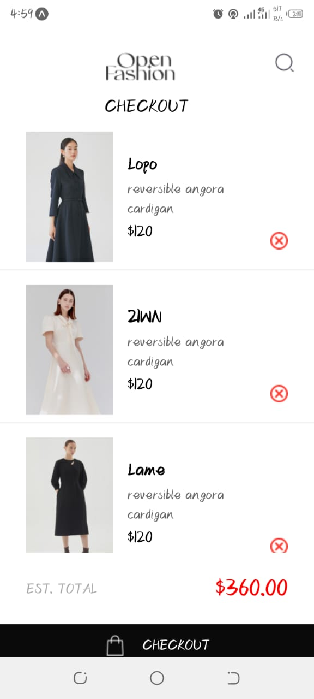

# rn-assignment6-11018835

# ID- 11018835

## Overview

Welcome to the shopping app! This React Native application helps you shop with ease. Here’s how it works:

### Navigation

Navigate through the app effortlessly using simple taps. The Home screen showcases various products available for purchase. Tap on any product to see details and add it to your cart. The Cart screen keeps track of all your selections.

### Shopping Cart and Data Storage

Your shopping cart items are securely stored using AsyncStorage, a local storage solution in React Native. This means your cart contents are saved even if you close the app. You can add, remove, and view items in your cart at any time, ensuring a seamless shopping experience.

### Screenshots

### How It Works

- **Navigation**: Use the bottom navigation buttons to switch between browsing products and viewing your cart.
- **Adding Items**: On the Home screen, tap the add button to include items in your cart.
- **Viewing Cart**: Head to the Cart screen to see all your selected items and their total cost.
- **Checking Out**: When ready, tap the checkout button on the Cart screen to complete your purchase.

